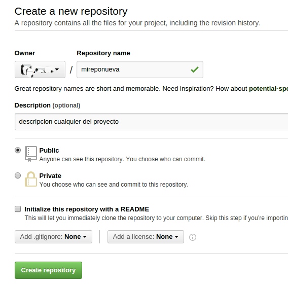

# Git/Github
Primera guia de pautas basicas para ver cómo funciona Git/Github.
Empecemos con Git (sistema de manejo de versiones), creando un repositorio local (en nuestra pc), y luego la subiremos a la nube de Github para q este disponible en la web.
En la 2da guia veremos cómo crear ramas de nuestro proyecto, y cómo ir y regresar a lo largo de nuestro historial de nuestra repo (viajar en el tiempo).
Sabiendo esto, ya tenemos lo basico para luego caminar solos.

## Git

Creamos un nuevo directorio "ruta"
```
$ mkdir ruta
$ cd ruta 
```

Ahora creamos archivos varios:
```
$ touch data1.hdf data1a.hdf data2.nc data_especial.h5 data_3.h5
$ touch script.py file.m file.pro
$ mkdir -p dir1/dir2 dir1/dir3
$ touch dir1/dir2/masdata.nc dir1/dir2/script2.py
```

Podemos seguir creando/modificando archivos en nuestro nuevo directorio "ruta".

Ahora supongamos q "ruta" incluye archivos muy pesados, por ejemplo, q tienen extension .hdf, .nc y .h5; entonces creamos un archivo ```.gitignore``` q define excepciones (q pueden ser excluyentes o inclusivas).
Entonces ```.gitignore``` contiene:
```
#lista de cosas q queremos excluir
*.hdf
*.nc
*.h5

#lista de cosas q queremos incluir (correccion a las exclusiones de arriba)
!data_especial.h5
```
Esto excluira todos los .hdf, .nc y .h5 PERO hará una excepción por ```data_especial.h5```; y asi podemos agregar mas lineas de excepciones exclusivas o inclusivas.

Ahora si inicializamos una estructura Git para nuestro directorio de trabajo:
```
$ git init .
```
Ahora adherimos todo el contenido de ```ruta``` a nuestro repositorio Git:
```
$ git add .
```
Opcionalmente, podemos pedir a Git q nos informe qué archivos exactamente vamos a adherir a nuestro repo:
```
$ git status
```
Ahora los adherimos ("comiteamos"), con algun mensaje adjunto (seguido del argumento -m):
```
$ git commit -m "mensaje relacionado al cambio q estamos haciendo"
```
Ahora le pedimos a Git q nos informe el estado de nuestra repo:
```
$ git status
```
Y nos debe aparecer algo como "Directory clean. Nothing to commit.", entonces PERFECTO!!, hemos construido nuestro primer log en el historial de nuestra repo.
En cualquier momento, podemos consultar nuestro historial con:
```
$ git log --graph --abbrev-commit --decorate --date=relative --format=format:'%C(bold blue)%h%C(reset) - %C(bold green)(%ar)%C(reset) %C(white)%s%C(reset) %C(dim white)- %an%C(reset)%C(bold yellow)%d%C(reset)' --all
```
Wow!! eso fue un poco largo, si!, pero vale la pena. Esto te muestra las fechas en q hiciste cada commit, y el mensaje adherido. En azul tambien veran un codigo alfanumerico llamado "hash del commit", el cual sirve como identificador uno desea regresar a esa "foto" del repositorio.


## Github
Ahora veamos como subir nuestro repositorio a la nube de Github (ahora nada tuvo q ver Github en esto). 
Pero primero, es recomendable configurar nuestro usuario/email en nuestra compu:
```
$ git config --global user.name "UnNombreTuyo_en_esta_compu"
$ git config --global user.email "user@mail.com"
```
donde, lo q esta en comillas, lo debes modificar con tus datos.

Ahora vayamos a nuestra cuenta Github, 
https://github.com/TuUsuario, donde ```TuUsuario``` es tu "username" y hagamos click en el simbolo "+" en la parte superior derecha, y luego en "New repository". Luego completamos como se muestra abajo:



Y luego hacemos click en "Create repository".
Ahora vamos a adherir nuestra repo de Github a nuestra repo local:
```
$ git remote add origin git@github.com:TuUsuario/mireponueva.git
```
Lo siguente es subir nuestra repo local a nuestra repo en Github, donde nos pedira nuestro usuario ```TuUsuario``` y password (para evitar q siempre nos pregunte esto, ver https://help.github.com/articles/adding-a-new-ssh-key-to-your-github-account):
```
$ git push -u origin master
```
Y listo!, hemos subido nuestra repo y su historial!
Para comprobar q los .hdf, .nc y .h5 no se han subido (culpa de como esta configurado nuestro .gitignore), podemos navegar en https://github.com/TuUsuario/mireponueva, y veremos q no existen, salvo el ```data_especial.h5```. Notar q los directorios vacios no se suben por defecto.

Ahora en nuestra pc podemos seguir modificando/creando/eliminando archivos y luego hacer:
```
$ cd ruta
$ git add .
$ git commit -m "algun mensaje"
```
Y si queremos subirla a la nube:
```
$ git push origin master #(sube a Github nuestra rama "master")
```

